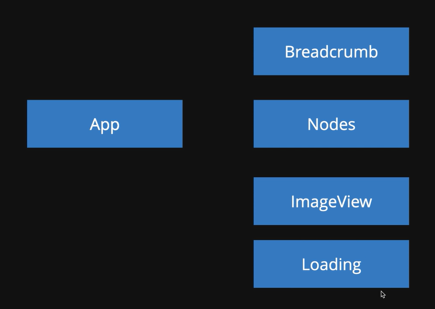

# 고양이 사진첩 만들기

## 구현 요구사항
- 고양이 사진 API를 통해 사진과 폴더를 렌더링한다.
- 폴더를 클릭하면 내부 폴더의 사진과 폴더를 보여준다.
  - 현재 경로가 어디인지도 렌더링한다.
- 루트 경로가 아닌 경우, 파일 목록 맨 앞에 뒤로가기를 넣는다.
- 사진을 누르면 고양이 사진을 모달창으로 보여준다.
  - esc를 누르거나 사진 밖을 클릭하면 모달을 닫는다.
- API를 불러오는 중인 경우 로딩 중임을 알리는 처리를 한다.



- API : 
```
https://mwu.roto-cat-api.programmers.co.kr/
https://cdn.roto.codes/css/cat-photos.css
https://cdn.roto.codes/images/file.png
https://cdn.roto.codes/images/prev.png
```